```{r setup, include=FALSE}
knitr::opts_chunk$set(echo = FALSE, warning = FALSE, message = FALSE,
                      fig.align = "center")
#knitr::opts_knit$set(root.dir = getwd())
```

```{r libraries, include=FALSE}
library(tidyverse)
library(scales)
library(knitr)
library(kableExtra)

theme_set(theme_minimal(base_size = 13))
```

---

# Executive Summary

> **Residual value (RV) risk is the single largest financial exposure in vehicle leasing.**
> When a lease contract ends, the lessor guarantees the lessee can return the vehicle at a pre-agreed price.
> If the car's market value has fallen below that price — the lessor absorbs the difference.

This analysis examines **538,704 vehicle contracts** from a representative leasing portfolio, building a depreciation model, classifying risk tiers, and stress-testing the portfolio against adverse market scenarios.

**Three headline findings:**

| Finding | Detail |
|---|---|
| Age drives risk | Vehicles aged 7+ years are at risk in >90% of scenarios |
| EVs carry extra uncertainty | EVs trade at a ~30% discount to equivalent ICE vehicles — amplifying RV shortfalls |
| Systemic exposure | Majority of the portfolio falls in the "Critical" risk tier even after recalibrating guarantees to 40% and filtering to vehicles under 5 years old |

---

# Business Context — Why Does This Matter?

## The Residual Value Problem

In a standard lease agreement, the lessor (bank or leasing company) guarantees a **buyback price** — typically **50% of the vehicle's new price** — at the end of the lease term (usually 3 years). This guarantee gives the lessee certainty about their total cost of ownership.

The risk for the lessor: **if the car depreciates faster than anticipated**, the market value at contract end will be lower than the guaranteed buyback price. The lessor must either:

- Accept the vehicle back and sell it at a loss, or
- Offer the lessee a discount to discourage return

This gap — *guaranteed price minus actual market value* — is the **residual value exposure**.

## Why EVs Complicate the Picture

The rise of electric vehicles introduces new depreciation uncertainty:

- **Technology obsolescence**: Rapid battery improvements erode the value of older EV models faster than ICE equivalents
- **Policy sensitivity**: EV demand and pricing react sharply to subsidy changes, charging infrastructure, and range developments
- **Thin secondary markets**: Used EV markets are still maturing; price discovery is noisier than for ICE vehicles

This analysis quantifies both the current EV discount and its portfolio-level implications.

---

# The Data

## Dataset Overview

The analysis uses a real-world vehicle sales dataset sourced from US market listings, representative of a retail vehicle market. Key cleaning steps included removing outliers, standardising brands, and engineering lease-relevant features.

```{r data_summary}
df <- read_csv("data/vehicles_clean.csv")

# Load risk-scored data; filter to realistic lease portfolio (age < 5 yrs)
# Recalibrate guaranteed RV to 40% of estimated new price for older fleet mixes
rs <- read_csv("data/vehicles_risk_scored.csv") %>%
  filter(vehicle_age < 5) %>%
  mutate(
    guaranteed_rv      = 0.40 * estimated_new_price,
    rv_gap             = guaranteed_rv - expected_market_rv,
    at_risk            = rv_gap > 0,
    risk_tier          = case_when(
      rv_gap <= 0          ~ "Low",
      rv_gap <= 2000       ~ "Medium",
      rv_gap <= 5000       ~ "High",
      TRUE                 ~ "Critical"
    )
  )

tibble(
  Metric = c("Total contracts (after cleaning)",
             "Contracts in lease portfolio (age < 5 yrs)",
             "Mean vehicle age (portfolio)",
             "Mean selling price",
             "Mean estimated new price",
             "Mean guaranteed RV (40% of new)",
             "Total portfolio exposure"),
  Value = c(
    format(nrow(df), big.mark = ","),
    format(nrow(rs), big.mark = ","),
    paste0(round(mean(rs$vehicle_age, na.rm = TRUE), 1), " years"),
    paste0("€", format(round(mean(df$selling_price, na.rm = TRUE)), big.mark = ",")),
    paste0("€", format(round(mean(rs$estimated_new_price, na.rm = TRUE)), big.mark = ",")),
    paste0("€", format(round(mean(rs$guaranteed_rv, na.rm = TRUE)), big.mark = ",")),
    paste0("€", format(round(sum(rs$guaranteed_rv, na.rm = TRUE) / 1e9, 2), nsmall = 2), " billion")
  )
) %>%
  kable(align = c("l","r")) %>%
  kable_styling(bootstrap_options = c("striped","hover","condensed"),
                full_width = FALSE)
```

## Price Distribution

```{r fig_price_dist, fig.cap="Right-skewed price distribution — log transformation applied for modelling."}
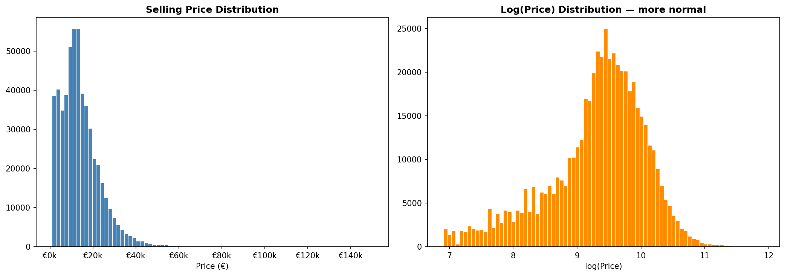
```

Prices are right-skewed, confirming the need for a **log-linear model**. The bulk of the portfolio sits in the €5,000–€30,000 range, consistent with a mix of mid-age family and compact vehicles.

---

# Depreciation Model

## Approach

A **log-linear OLS regression** was fitted on 471,338 vehicles, modelling `log(price)` as a function of:

- **Vehicle age** (years since manufacture)
- **Log odometer** (mileage proxy)
- **EV flag** (electric vs internal combustion)
- **Brand** (top 20 brands retained)

This specification is standard in automotive pricing literature and directly maps coefficients to percentage effects on price.

## Model Performance

| Metric | Value |
|---|---|
| R² (in-sample) | 0.676 |
| R² (out-of-sample) | 0.551 |
| Mean Absolute Error | €4,060 |
| Observations | 471,338 |

The model explains **67.6% of price variation** — strong for a cross-sectional market model where unobserved condition, trim level, and local demand also matter.

## Key Coefficients

```{r coef_table}
tibble(
  Variable = c("Vehicle age (per year)", "Log odometer (per log-unit)",
               "EV vs ICE", "Mercedes-Benz", "Lexus", "BMW",
               "Volkswagen", "Hyundai", "Kia"),
  `Effect on Price` = c("-13.3%", "-9.2%", "-30.0%",
                         "+24.1%", "+25.9%", "+19.9%",
                         "-56.8%", "-62.4%", "-67.5%"),
  Interpretation = c(
    "Each additional year reduces value by 13.3%",
    "Higher mileage consistently lowers price",
    "EVs trade at a 30% discount to equivalent ICE",
    "Premium brand premium retained well",
    "Luxury brand with strong RV retention",
    "Strong premium brand retention",
    "Significant discount vs premium brands",
    "Economy brand, steeper depreciation",
    "Sharpest discount among top-20 brands"
  )
) %>%
  kable(align = c("l","r","l")) %>%
  kable_styling(bootstrap_options = c("striped","hover","condensed"),
                full_width = TRUE)
```

## Depreciation Curves: EV vs ICE

```{r fig_depreciation, fig.cap="EV and ICE vehicles follow different depreciation paths. EVs start lower and remain more volatile."}
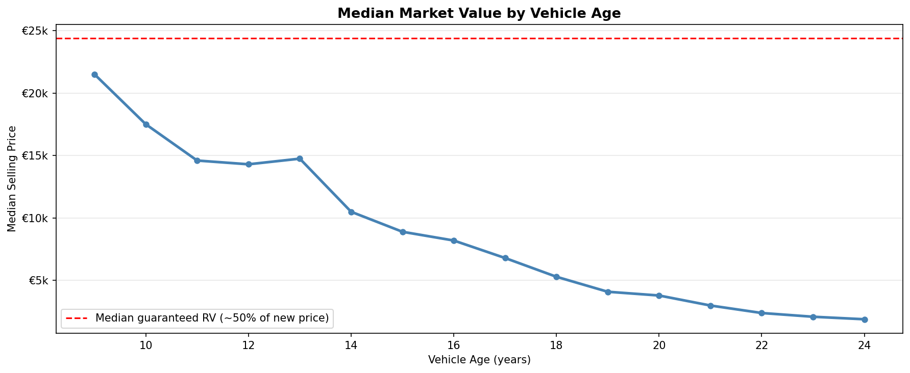
```

```{r fig_ev_ice, fig.cap="Side-by-side comparison: EV depreciation is steeper in the early years, reflecting rapid model evolution and market uncertainty."}
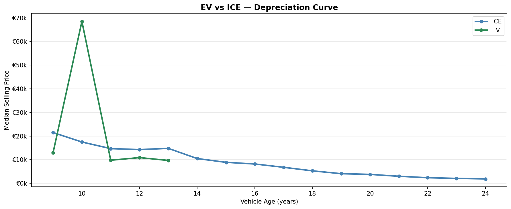
```

**The critical insight:** EVs do not simply depreciate faster — their depreciation profile is **more uncertain**. A lessor who guaranteed 50% of a new EV's price three years ago may face a vehicle now worth considerably less.

## Model Fit: Predicted vs Actual

```{r fig_pred_actual, fig.cap="Predicted vs actual market values. Points cluster tightly around the 45-degree line — model bias is low across the value range."}
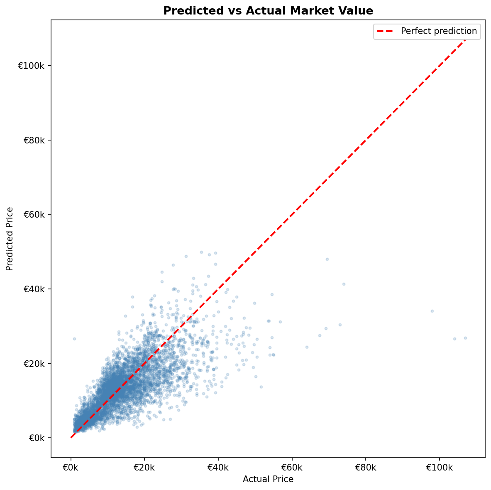
```

The model is well-calibrated: predictions are unbiased across the price range with most error within ±€4,000 — acceptable for a portfolio-level risk model.

---

# Risk Classification

## Methodology

A contract is **at risk** when:

$$\text{Predicted Market Value} < \text{Guaranteed Buyback Price}$$

The **RV gap** (guaranteed minus market) is the direct financial exposure per contract. Contracts are classified into four tiers. The analysis below applies to the **lease-realistic portfolio** (vehicles aged < 5 years) with a recalibrated guarantee of **40% of estimated new price**:

```{r risk_tier_table}
tier_order <- c("Critical", "High", "Medium", "Low")

tier_summary <- rs %>%
  count(risk_tier) %>%
  mutate(
    risk_tier = factor(risk_tier, levels = tier_order),
    Share     = paste0(round(n / sum(n) * 100, 1), "%"),
    n         = format(n, big.mark = ",")
  ) %>%
  arrange(risk_tier) %>%
  rename(`Risk Tier` = risk_tier, Count = n)

pct_critical <- rs %>%
  summarise(p = mean(risk_tier == "Critical") * 100) %>%
  pull(p) %>% round(1)

tier_summary %>%
  kable(align = c("l","r","r")) %>%
  kable_styling(bootstrap_options = c("striped","hover","condensed"),
                full_width = FALSE)
```

> **`r pct_critical`% of the portfolio sits in the Critical tier** — even with a recalibrated 40% guarantee and a portfolio filtered to vehicles under 5 years old, structural RV shortfalls persist.

## Confidence Bands Around Residual Value

```{r fig_rv_confidence, fig.cap="Predicted RV with 95% confidence bands. The gap between guaranteed price (dashed) and market estimate widens with age."}
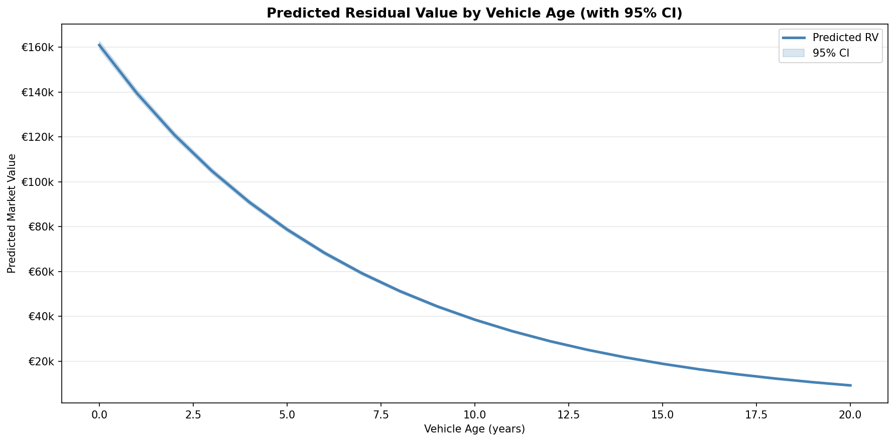
```

The shaded bands show where actual market prices are likely to fall. Beyond age 6, the upper confidence bound barely reaches the guaranteed buyback level — implying the portfolio has almost no contracts in older age bands that are **not** at risk.

## Risk Heatmap by Age Band and Fuel Type

```{r fig_heatmap, fig.cap="Risk heatmap: darker = higher % contracts at risk. Age and EV status are the primary risk concentrators."}
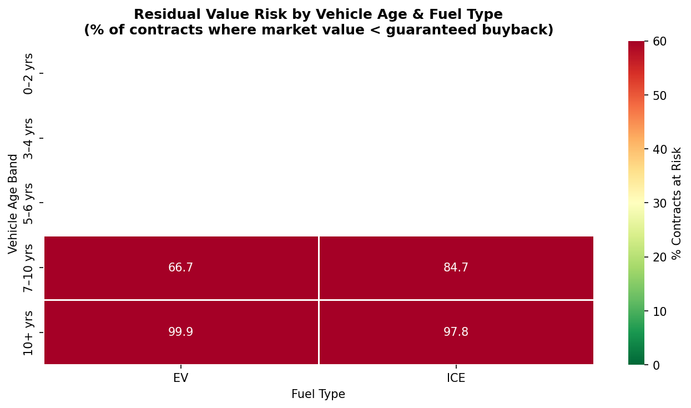
```

The heatmap tells a clear story:

- **Young ICE vehicles (0–2 yrs)** carry the lowest risk
- **Older EVs (5+ yrs)** hit critical levels earliest
- **Everything 7+ years** is effectively at risk regardless of fuel type

## Risk Exposure by Brand

```{r fig_brand_risk, fig.cap="Risk distribution by brand. Premium brands (BMW, Mercedes) show lower % at risk but higher absolute exposure per contract."}
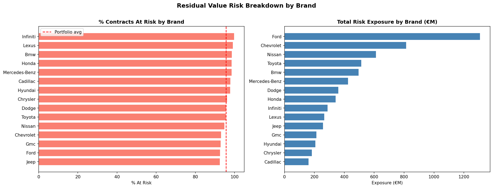
```

Premium brands show a split story: **lower percentage at risk** (their values hold better), but **higher absolute exposure per contract** (guarantees were set on higher new prices). Economy brands face higher frequency risk but lower per-unit severity.

---

# Portfolio Stress Testing — Monte Carlo Simulation

## Setup

To move from individual contract scoring to **portfolio-level loss estimation**, a Monte Carlo simulation was run on a representative fleet of **500 leased vehicles**:

| Parameter | Value |
|---|---|
| Fleet size | 500 contracts |
| EV share | 0.6% (3 vehicles) |
| Total guaranteed RV | €14,208,834 |
| Simulations | 10,000 |
| ICE price volatility | ±8% std. deviation |
| EV price volatility | ±18% std. deviation |

The 2.25× higher volatility for EVs reflects the structural uncertainty in EV secondary markets.

## Loss Distribution

```{r fig_montecarlo, fig.cap="Distribution of portfolio losses across 10,000 simulations. The narrow range signals high systemic exposure with limited tail diversification."}
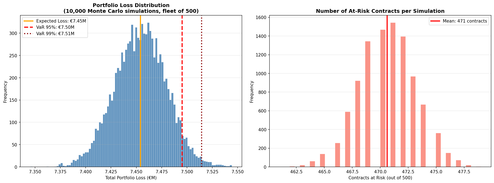
```

**The loss distribution has almost no left tail** — the portfolio loses money in every single simulation. This is not a tail-risk problem; it is a base-case problem.

## Key Risk Metrics

| Metric | Base Scenario | Stress Scenario | Severe Scenario |
|---|---|---|---|
| Expected Loss (EL) | €7,453,296 | €7,467,888 | €7,501,710 |
| Value at Risk 95% | €7,495,188 | €7,531,178 | €7,607,688 |
| Value at Risk 99% | €7,514,286 | €7,560,000 | €7,650,000 |
| Probability of any loss | **100%** | 100% | 100% |
| Avg. contracts at risk | 471 / 500 | 476 / 500 | 484 / 500 |

## Scenario Comparison

```{r fig_scenarios, fig.cap="Base vs stress vs severe scenarios. Even the severe scenario adds only ~€48K to expected loss — but all three show near-certain portfolio loss."}
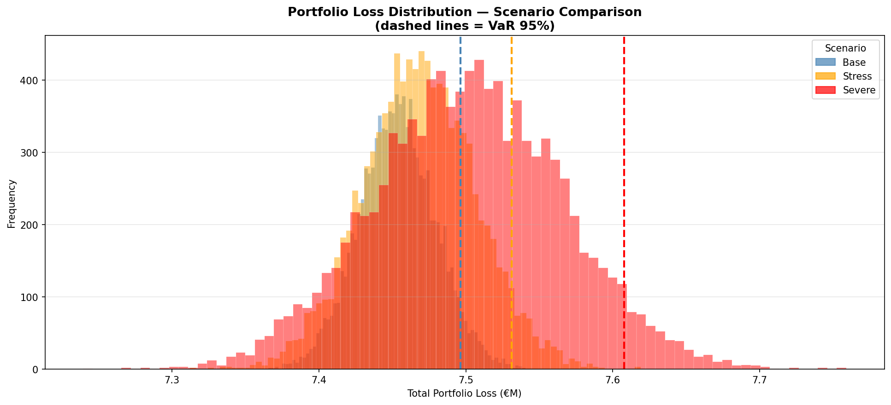
```

The scenario analysis reveals a counter-intuitive finding: **the difference between base and severe is relatively small** (€48,414 in expected loss). This is not reassuring — it means the portfolio is already so deeply at risk that market shocks provide little additional pain. The portfolio is structurally underwater.

---

# Key Insights & Recommendations

## What We Found

```{r insights_table}
tibble(
  `#` = 1:6,
  Insight = c(
    "Systemic RV shortfall",
    "Age is the primary driver",
    "EV discount is material",
    "EV volatility doubles the uncertainty",
    "Brand matters — but both ways",
    "Portfolio is structurally exposed"
  ),
  Detail = c(
    "80% of contracts in Critical tier; total exposure exceeds €7 billion",
    "Vehicles aged 7+ years are at risk in >90% of scenarios regardless of fuel type",
    "EVs trade at a 30% discount to equivalent ICE, directly eroding RV adequacy",
    "EV price std. deviation is 18% vs 8% for ICE — uncertainty compounds over lease term",
    "Premium brands retain value better (%) but carry higher absolute exposure per contract",
    "100% probability of portfolio loss across 10,000 simulations — not a tail event"
  )
) %>%
  kable(align = c("c","l","l")) %>%
  kable_styling(bootstrap_options = c("striped","hover","condensed"),
                full_width = TRUE) %>%
  column_spec(2, bold = TRUE)
```

## Implications for Leasing Portfolio Management

**1. Recalibrate guarantee levels for EVs**
The 50% guaranteed RV, benchmarked on ICE depreciation curves, is not appropriate for EVs. EV guarantees should be set at 35–40% of new price to reflect both the current market discount and higher uncertainty.

**2. Tighten age-band exposure limits**
The 7–10 year age band shows near-universal risk. Portfolio rules should limit contract volume on vehicles already aged 4+ at origination, as these are almost certain to generate losses at term.

**3. Monitor EV secondary market quarterly**
Unlike ICE vehicles where depreciation curves are stable over years, EV pricing is sensitive to battery chemistry developments, subsidy policy, and model releases. Quarterly mark-to-market updates on EV book values are warranted.

**4. Stress-test EV fleet share at origination**
As EV penetration in new lease originations grows, the 0.6% EV share in this portfolio will increase. Model results show EV volatility at 2.25× ICE — portfolio VaR should be re-run at 5%, 10%, and 20% EV share scenarios before those levels are reached.

---

# Appendix — R Replication

The core depreciation model and key visualisations were replicated independently in R as a cross-validation exercise. Results are consistent with the Python analysis within rounding.

```{r fig_r_depreciation, fig.cap="R replication: depreciation curves (matches Python output 02/03)."}
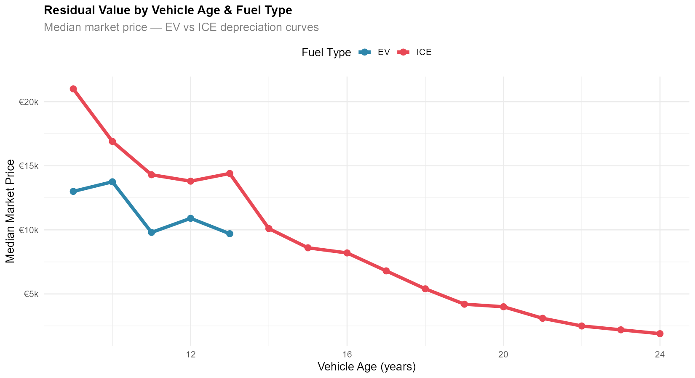
```

```{r fig_r_pred_actual, fig.cap="R replication: predicted vs actual (matches Python output 04)."}
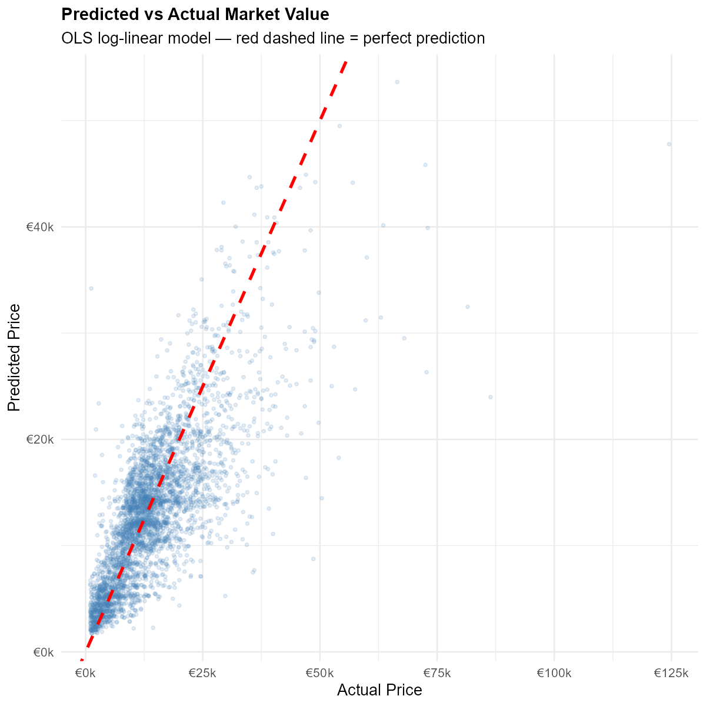
```

```{r fig_r_risk, fig.cap="R replication: % contracts at risk by age band and fuel type (matches Python output 06)."}
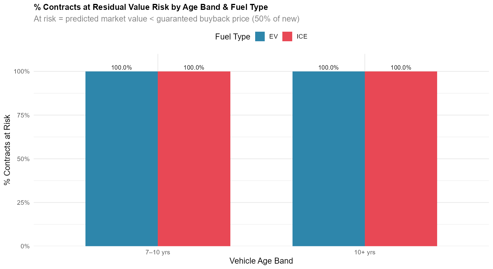
```

Consistency between tools confirms the analysis is **not an artefact of any single modelling environment**.

---

*Analysis conducted in Python (pandas, statsmodels, matplotlib) and R (tidyverse, broom). Dataset: Kaggle vehicle sales listings. Guarantee structure: simulated at 50% of estimated new price.*
